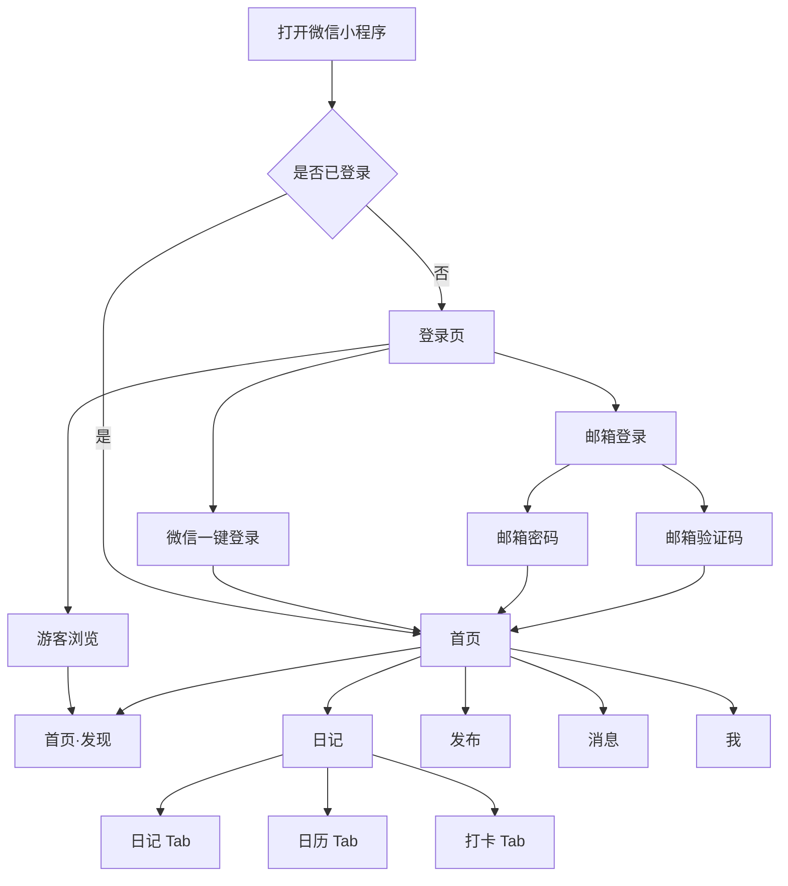
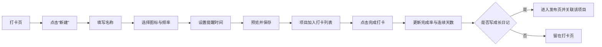

# 日迹微信小程序需求文档

| 项目 | 内容 |
| --- | --- |
| 产品名称 | 日迹 |
| 产品形态 | 微信小程序 |
| 文档版本 | V1.0 |
| 文档日期 | 2026-07-11 |
| 首版范围 | 生活记录、个人打卡、公开分享与轻社区 |
| 交互原型 | [日迹交互原型](../功能页面设计/生活打卡小程序交互原型.html) |

## 1. 项目背景

### 1.1 背景说明

年轻用户普遍存在运动、阅读、学习、早睡等自我成长需求，但现有产品通常分为两类：一类只提供机械式打卡和统计，缺少生活表达；另一类偏重公开分享，个人长期记录容易被信息流淹没。

“日迹”将成长日记和习惯打卡结合：用户可以先记录自己的生活与行动，再自行决定是否公开分享。产品既能作为私人生活记录工具长期使用，也能通过轻社区让用户看到他人的真实成长过程。

### 1.2 用户问题

- 普通日记产品缺少目标、连续行动和完成反馈。
- 纯打卡产品记录内容单一，长期使用容易失去新鲜感。
- 公开内容平台强调流量和展示，用户对隐私与表达压力存在顾虑。
- 生活记录、习惯管理和公开分享分散在多个产品中，数据无法形成完整成长轨迹。

### 1.3 产品机会

- 微信小程序无需单独安装，适合高频、轻量记录。
- “私密记录为默认、公开分享为选择”可降低用户开始记录的心理门槛。
- 图文成长内容与打卡标签结合，可形成区别于普通社交内容的主题社区。
- 日历、连续天数和阶段回顾能增强内容沉淀与长期留存。

### 1.4 首版边界

首版聚焦个人日记、自由打卡、图文发布、发现内容流和基础互动。不包含短视频、直播、陌生人私信、付费会员、商城、组队挑战、排行榜和复杂推荐算法。

## 2. 产品定位与目标

### 2.1 产品定位

一款面向年轻用户的生活成长记录微信小程序。用户通过图文日记保存生活片段，通过自定义打卡维持行动，并可将部分记录公开到成长社区。

### 2.2 核心价值

- **对个人：** 低压力记录生活，持续完成目标，形成可回顾的成长轨迹。
- **对社区：** 分享真实行动和阶段成果，发现有参考价值的成长方式。
- **对产品：** 用个人记录建立基础留存，用社区互动增强内容消费和回访。

### 2.3 设计原则

1. 默认私密：新建日记默认仅自己可见，公开必须由用户主动选择。
2. 记录优先：社区互动不能影响用户记录、回顾和管理个人内容。
3. 操作轻量：一次快速打卡应在两次点击内完成。
4. 正向反馈：展示完成率、连续天数和里程碑，不设置惩罚性排名。
5. 内容真实：公开内容必须围绕生活记录、行动过程或成长结果。

### 2.4 产品目标

| 目标类型 | 首版目标 |
| --- | --- |
| 用户目标 | 5 分钟内完成登录、创建第一个打卡项目并发布第一条日记 |
| 体验目标 | 用户能清楚区分“公开发现内容”和“个人日记” |
| 留存目标 | 通过提醒、连续打卡、日历回顾和社区互动促进持续使用 |
| 内容目标 | 建立以运动、阅读、学习、作息和生活记录为主的公开内容池 |
| 安全目标 | 默认私密，提供举报、拉黑、删除和账号安全能力 |

### 2.5 首版观察指标

| 指标 | 计算方式 | 建议目标 |
| --- | --- | --- |
| 首次激活率 | 注册后 24 小时内创建打卡或日记的用户数 / 新注册用户数 | 不低于 45% |
| 首次打卡完成率 | 创建打卡后 24 小时内完成一次打卡的用户数 / 创建打卡用户数 | 不低于 60% |
| 7 日留存率 | 注册后第 7 天再次访问的用户数 / 当日新注册用户数 | 不低于 20% |
| 周记录率 | 一周内至少发布 2 条日记的活跃用户数 / 周活跃用户数 | 不低于 35% |
| 公开分享率 | 公开日记数 / 全部日记数 | 仅观察，不设置强制目标 |

## 3. 用户分析

### 3.1 目标用户

- 年龄以 18-35 岁为主。
- 有生活记录、自律成长或轻社交需求。
- 常见目标包括运动、阅读、学习、饮水、早睡和情绪整理。
- 希望获得反馈，但不希望所有个人内容默认公开。

### 3.2 典型用户画像

| 用户 | 特征 | 核心诉求 | 主要障碍 |
| --- | --- | --- | --- |
| 自律初学者 | 刚开始培养习惯，目标较多 | 简单提醒、快速打卡、看到进步 | 容易中断，不喜欢复杂配置 |
| 生活记录者 | 喜欢拍照和写短文 | 按时间保存生活，方便以后回顾 | 普通相册缺少文字和成长关联 |
| 成长分享者 | 愿意公开运动、学习成果 | 获得点赞、评论和同伴反馈 | 不希望私人日记误公开 |
| 轻度浏览者 | 暂时没有明确打卡目标 | 浏览他人经验，收藏有用内容 | 不愿首次打开就被强制注册 |

### 3.3 核心需求优先级

| 优先级 | 需求 |
| --- | --- |
| P0 | 登录、写日记、自定义打卡、完成打卡、默认私密、查看个人记录 |
| P0 | 浏览公开内容、发布图文、点赞、评论、收藏、举报 |
| P1 | 关注、消息通知、日历回顾、基础统计、草稿箱、提醒 |
| P2 | 每周成长回顾、里程碑、官方打卡模板、主题挑战 |

### 3.4 典型使用场景

1. 用户早晨跑步后快速完成打卡，晚上补充文字和图片形成日记。
2. 用户在首页“发现”浏览阅读类内容，收藏一条书单并关注作者。
3. 用户将一条默认私密的日记修改为公开，获得点赞和评论通知。
4. 用户在日历中回顾一个月的记录，查看打卡完成率和连续天数。
5. 游客先浏览公开内容，在点赞、关注、发布或打卡时进入登录流程。

## 4. 产品流程

### 4.1 整体主流程



### 4.2 登录流程

1. 首次进入展示微信登录、邮箱登录和游客浏览。
2. 点击邮箱登录后，在“密码登录”和“验证码登录”之间切换。
3. 新邮箱通过验证码校验后进入注册流程并设置密码。
4. 已绑定微信或邮箱的用户进入原账号。
5. 微信身份和邮箱分别存在账号时，必须再次验证后由用户确认合并，禁止自动覆盖日记或打卡数据。
6. 游客仅能浏览公开内容；点赞、收藏、关注、评论、发布、日记和打卡操作均要求登录。

### 4.3 新建与完成打卡流程



### 4.4 日记发布流程

1. 用户从底部“发布”进入编辑页。
2. 填写标题、正文和最多 9 张图片。
3. 可选关联一个打卡项目。
4. 选择可见范围，默认“仅自己”。
5. 保存后进入首页“日记”时间线。
6. 公开内容通过审核后进入首页“发现”，并展示在个人公开主页。

### 4.5 社区互动流程

1. 用户从首页“发现”打开内容详情。
2. 可进行点赞、评论、收藏、关注、举报或拉黑。
3. 点赞、收藏、评论和新增关注进入作者消息中心。
4. 删除公开日记后，发现流、个人主页、收藏列表和内容详情同步不可见。

## 5. 信息架构（页面结构）

```text
日迹微信小程序
├── 登录与注册
│   ├── 登录选择：微信登录 / 邮箱登录 / 游客浏览
│   ├── 邮箱登录：密码登录 / 验证码登录
│   ├── 邮箱注册
│   ├── 忘记密码
│   └── 账号绑定与合并
├── 首页（底部导航 1）
│   ├── 双列公开内容流
│   ├── 搜索
│   └── 内容详情
├── 日记（底部导航 2）
│   ├── 日记（顶部 Tab，默认）
│   │   ├── 个人时间线
│   │   └── 日记详情与管理
│   ├── 日历（顶部 Tab）
│   │   ├── 月历回顾
│   │   └── 日期记录摘要
│   ├── 打卡（顶部 Tab）
│   │   ├── 今日完成概览
│   │   ├── 今日计划卡片
│   │   ├── 新建打卡
│   │   └── 编辑与归档
├── 发布（底部导航 3）
│   ├── 图文编辑
│   ├── 关联打卡
│   ├── 可见范围
│   └── 草稿箱
├── 消息（底部导航 4）
│   ├── 赞与收藏
│   ├── 评论与提及
│   ├── 新增关注
│   └── 系统通知
└── 我（底部导航 5）
    ├── 公开主页
    ├── 收藏
    ├── 成长数据
    ├── 编辑资料
    ├── 隐私与账号设置
    ├── 黑名单与举报记录
    └── 退出登录
```

底部导航固定为“首页、日记、发布、消息、我”。首页直接展示发现内容流；进入“日记”后，标题栏固定为“日记、日历、打卡”，默认选择“日记”，同一使用会话内返回时保留用户最后选择的顶部 Tab。

## 6. 功能需求（核心）

功能优先级说明：P0 为首版上线必需，P1 为首版建议完成，P2 为后续候选。

### 6.1 账号与登录

| 编号 | 优先级 | 功能 | 业务规则 |
| --- | --- | --- | --- |
| FR-ACC-001 | P0 | 微信登录 | 用户同意协议后通过微信会话登录；头像和昵称由用户主动填写或授权 |
| FR-ACC-002 | P0 | 邮箱密码登录 | 邮箱格式必须有效；密码至少 8 位且包含字母和数字 |
| FR-ACC-003 | P0 | 邮箱验证码登录 | 验证码为 6 位数字，10 分钟有效，60 秒内不可重复发送 |
| FR-ACC-004 | P0 | 邮箱注册 | 未注册邮箱验证成功后设置密码并创建账号 |
| FR-ACC-005 | P0 | 找回密码 | 已绑定邮箱验证成功后允许设置新密码 |
| FR-ACC-006 | P0 | 游客模式 | 允许浏览公开内容，写入类操作触发登录 |
| FR-ACC-007 | P1 | 账号绑定 | 支持登录后绑定或解绑微信、邮箱；操作前需再次验证 |
| FR-ACC-008 | P1 | 账号合并 | 合并前展示两个账号的数据摘要，由用户确认保留策略 |

安全限制：同一验证码连续输错 5 次后失效；密码连续失败 5 次后暂停登录 15 分钟；验证码发送需要按邮箱、账号、设备和 IP 限流。

### 6.2 首页·发现

| 编号 | 优先级 | 功能 | 业务规则 |
| --- | --- | --- | --- |
| FR-DIS-001 | P0 | 公开内容流 | 使用双列图文流展示已通过审核的公开日记 |
| FR-DIS-002 | P0 | 内容详情 | 点击发现卡片进入全屏详情，展示作者、正文、图片、关联打卡、发布时间和互动数据 |
| FR-DIS-003 | P0 | 点赞 | 同一用户对同一内容只能产生一个有效点赞，可取消 |
| FR-DIS-004 | P0 | 评论与回复 | 评论内容长度为 1-500 字；支持一级评论、回复指定用户、评论点赞和展开回复；作者可删除自己内容下的评论 |
| FR-DIS-005 | P0 | 收藏 | 收藏内容进入“我-收藏”，原内容删除后显示已失效 |
| FR-DIS-006 | P1 | 关注 | 支持关注和取消关注，关注内容可在发现页顶部筛选 |
| FR-DIS-007 | P1 | 搜索 | 支持按标题、正文关键词、打卡标签和用户昵称搜索 |
| FR-DIS-008 | P0 | 举报与拉黑 | 举报需选择原因；拉黑后双方内容和互动按隐私规则隔离 |

首版发现流采用按发布时间、内容质量和基础互动加权的简单排序，不建设复杂个性化推荐算法。

### 6.3 日记·日记

| 编号 | 优先级 | 功能 | 业务规则 |
| --- | --- | --- | --- |
| FR-DIA-001 | P0 | 日记时间线 | 按发布时间倒序展示当前用户的私密和公开日记 |
| FR-DIA-002 | P0 | 可见状态 | 每条日记明确展示“仅自己、关注我的人、公开”状态 |
| FR-DIA-003 | P0 | 编辑与删除 | 用户可编辑或删除自己的日记；删除前二次确认 |
| FR-DIA-004 | P1 | 日历回顾 | 月视图标记有记录的日期；支持前后切月、返回今天，并按选中日期展示日记和关联打卡结果 |
| FR-DIA-005 | P1 | 条件筛选 | 支持按打卡项目、可见范围和时间筛选 |

### 6.4 日记·打卡

| 编号 | 优先级 | 功能 | 业务规则 |
| --- | --- | --- | --- |
| FR-CHK-001 | P0 | 新建打卡 | 填写名称，选择图标、重复频率和提醒时间，并实时预览 |
| FR-CHK-002 | P0 | 快速打卡 | 在列表点击状态按钮完成或取消当天打卡 |
| FR-CHK-003 | P0 | 今日完成概览 | 实时更新今日完成数、项目总数、完成率和进度条；完成项使用划线和选中状态区分 |
| FR-CHK-004 | P1 | 连续天数 | 按项目统计当前连续天数、最长连续天数和累计次数 |
| FR-CHK-005 | P1 | 编辑与归档 | 支持修改名称、频率和提醒；归档后不再进入今日列表 |
| FR-CHK-006 | P1 | 提醒 | 使用微信订阅消息，必须获得用户单次或长期授权 |
| FR-CHK-007 | P1 | 关联日记 | 完成打卡后可进入发布页，自动关联该打卡项目 |
| FR-CHK-008 | P1 | 左滑删除 | 项目行左滑露出垃圾箱；点击后须二次确认，确认删除后重新计算统计 |

新建规则：名称必填且长度为 1-20 字；图标和频率必选；提醒时间可关闭；同一用户可创建重名项目，但保存时需要提示确认。

连续规则：按项目设定的有效日期计算；取消当天打卡后重新计算；不支持通过修改设备时间伪造记录。

### 6.5 发布与草稿

| 编号 | 优先级 | 功能 | 业务规则 |
| --- | --- | --- | --- |
| FR-PUB-001 | P0 | 图文编辑 | 标题选填，最长 30 字；正文必填，长度为 1-2000 字 |
| FR-PUB-002 | P0 | 图片上传 | 支持 0-9 张 JPG、PNG、WebP 图片，单张不超过 10 MB |
| FR-PUB-003 | P0 | 关联打卡 | 每条日记最多关联一个打卡项目 |
| FR-PUB-004 | P0 | 可见范围 | 默认仅自己，可改为关注我的人或公开 |
| FR-PUB-005 | P1 | 草稿 | 手动存草稿；编辑离开且内容未保存时提示是否保存 |
| FR-PUB-006 | P0 | 内容审核 | 公开内容发布前进行文本和图片安全检查 |
| FR-PUB-007 | P0 | 发布结果 | 保存成功后进入首页“日记”，失败时保留本地编辑内容 |
| FR-PUB-008 | P0 | 返回上一界面 | 点击发布页左上角返回箭头时返回进入发布页前的界面 |

### 6.6 消息

| 编号 | 优先级 | 功能 | 业务规则 |
| --- | --- | --- | --- |
| FR-MSG-001 | P1 | 互动通知 | 聚合点赞、收藏、评论、提及和新增关注 |
| FR-MSG-002 | P1 | 系统通知 | 展示审核结果、账号安全和成长回顾通知 |
| FR-MSG-003 | P1 | 未读状态 | 底部导航显示未读红点，支持单条已读和全部已读 |
| FR-MSG-004 | P1 | 分类查看 | 按赞与收藏、评论与提及、新增关注进行筛选 |

首版不提供用户私信，避免引入额外骚扰风险和内容审核成本。

### 6.7 个人主页与社交关系

| 编号 | 优先级 | 功能 | 业务规则 |
| --- | --- | --- | --- |
| FR-PRO-001 | P0 | 个人资料 | 设置头像、昵称、成长号和个人简介 |
| FR-PRO-002 | P0 | 公开主页 | 仅展示公开日记和公开统计，不展示私密内容 |
| FR-PRO-003 | P1 | 收藏列表 | 查看和取消收藏公开内容 |
| FR-PRO-004 | P1 | 成长数据 | 展示日记数、累计打卡、完成率和连续天数 |
| FR-PRO-005 | P1 | 关注关系 | 查看关注和粉丝列表，支持取消关注与移除粉丝 |
| FR-PRO-006 | P0 | 账号设置 | 管理登录方式、隐私、黑名单和账号注销 |

### 6.8 隐私、内容安全与异常处理

- 日记默认“仅自己”，每次新建均不得继承上一条公开状态。
- 改为公开前明确提示该内容将出现在发现流和个人公开主页。
- 私密日记不得被搜索、分享链接或其他用户接口访问。
- 用户删除账号前展示数据影响并进行二次验证；注销后按法规要求处理数据。
- 上传失败、网络断开或发布失败时保留编辑内容，允许重试。
- 内容审核拒绝时给出明确原因，并提供申诉入口。
- 举报原因至少包括违法违规、色情低俗、骚扰攻击、虚假内容、侵权和其他。

### 6.9 后续候选功能（不纳入首版验收）

- 每周成长回顾：自动汇总本周完成率、连续记录和精选日记。
- 里程碑：连续 7 天、30 天、100 次等非排名式成就。
- 官方模板：阅读、运动、学习、饮水和作息模板。
- 主题挑战：用户主动加入 7 天或 30 天挑战，不设置强制竞争排名。
- 数据导出：将个人日记和打卡数据导出为文件。
- AI 总结：仅在用户主动授权后总结个人记录，不提供医疗或心理诊断。

## 7. 页面原型与交互

### 7.1 原型文件

原型文件：[日迹交互原型](../功能页面设计/生活打卡小程序交互原型.html)。该文件为单页可点击演示，使用模拟数据，不会发送验证码、执行真实微信授权或写入服务器。

### 7.2 页面说明

| 页面 | 主要内容 | 核心交互 |
| --- | --- | --- |
| 登录选择 | 微信登录、邮箱登录、协议、游客浏览 | 邮箱登录进入二级页面；未同意协议时禁止登录 |
| 邮箱登录 | 密码登录、验证码登录两个 Tab | 显示密码、发送验证码、注册、忘记密码、返回 |
| 首页 | 双列公开内容流、搜索 | 点击卡片进入全屏详情，点赞、评论、收藏 |
| 日记详情 | 作者与关注、图文正文、打卡标签、评论区、底部互动栏 | 关注作者、点赞、收藏、发布评论、回复指定用户、评论点赞 |
| 日记 | 标题栏“日记、日历、打卡”Tab、个人时间线、月历和今日计划 | 点击标题栏或左右滑动内容切换三个视图 |
| 日记·日历 | 月历、本月摘要、选中日期的日记和打卡记录 | 前后切月、回到今天、点击日期切换当日记录、无记录空状态 |
| 日记·打卡 | 黑色完成概览、今日计划卡片 | 点击圆形状态完成或取消；左滑项目显示删除；底部按钮进入新建页 |
| 新建打卡 | 名称、图标、频率、提醒、预览 | 实时预览，空名称提示，保存后返回列表并更新总数 |
| 发布 | 标题、正文、图片、标签、可见范围 | 存草稿或保存日记，成功后进入“日记” |
| 消息 | 三类快捷入口、通知列表 | 分类筛选、全部已读、跳转相关内容 |
| 我 | 个人资料、统计、公开内容、收藏、数据 | 编辑资料、切换内容 Tab、分享主页、退出登录 |
| 编辑资料 | 头像、昵称、成长号、个人简介 | 回显当前资料，校验后保存并更新个人主页，取消不修改 |

### 7.3 全局交互规则

- 底部导航固定为：首页、日记、发布、消息、我。
- 首页直接展示发现内容；日记页标题栏固定为“日记、日历、打卡”，首次进入默认选择日记，支持点击标题和左右滑动内容依次切换。
- 关键成功操作使用轻提示反馈，错误必须说明原因和解决方式。
- 删除、注销、账号合并和内容改为公开等高风险操作需要二次确认。
- 表单离开前存在未保存内容时必须提示保存、放弃或继续编辑。
- 加载中使用稳定占位，避免列表抖动；无数据时展示对应空状态和主操作。

### 7.4 视觉设计

- 参考小红书的明亮、图片优先和紧凑内容表达，但不复制其商标、图标和品牌文案。
- 主背景为白色，主要文字为黑色，关键操作色为红色 `#FF2442`。
- 打卡完成、连续成长等正向状态使用绿色 `#25A66A`。
- 发现页使用双列图片流；个人日记、打卡和消息使用单列布局。
- 卡片圆角不超过 8 px，表单控件保持统一高度，底部发布入口居中突出。
- 适配微信常见机型安全区域，文字、按钮和图片不得遮挡或超出容器。

## 8. 验收标准

### 8.1 账号与登录

- [ ] 首次打开能看到“微信一键登录”和“邮箱登录”两个一级入口。
- [ ] 点击邮箱登录后能切换“密码登录”和“验证码登录”。
- [ ] 未勾选用户协议与隐私政策时，登录操作被阻止并显示原因。
- [ ] 正确微信身份、邮箱密码或有效验证码均能进入同一用户账号。
- [ ] 错误邮箱格式、错误密码和失效验证码均有明确错误提示。
- [ ] 游客可以浏览发现内容，但写入类操作会进入登录流程。

### 8.2 首页与日记

- [ ] 登录后进入首页并直接展示发现内容流。
- [ ] 发现流只展示审核通过且可见范围为公开的内容。
- [ ] 点击发现流任一卡片进入全屏日记详情，不再使用底部弹层承载完整内容。
- [ ] 详情页展示作者头像与昵称、关注和分享、主图、标题、正文、打卡标签、时间地点及互动数据。
- [ ] 详情页评论区展示评论总数、一级评论和用户间回复，并支持评论点赞和回复指定用户。
- [ ] 底部固定输入栏支持提交 1-500 字评论；提交后评论立即出现，评论数同步增加。
- [ ] 底部导航第二项为“日记”，点击后标题栏直接展示“日记、日历、打卡”，不额外占用一行 Tab，默认选择日记。
- [ ] 日记 Tab 能同时展示用户自己的私密和公开日记，并明确标记状态。
- [ ] 点击标题或在内容区左右滑动可以依次切换“日记、日历、打卡”，切换方向与手势一致。
- [ ] 切换到打卡 Tab 后展示黑色完成概览和“今日计划”卡片列表。
- [ ] 日历直接显示在顶部日历 Tab 内，不进入独立页面；日历 Tab 右上角提供“今天”操作。
- [ ] 日历支持前后切月和回到今天；有记录的日期显示绿色标记，选中日期显示红色状态。
- [ ] 点击日期后，下方同步展示当天日记与关联打卡摘要；无记录日期显示明确空状态。
- [ ] 新建日记默认仅自己可见，不能自动继承上一条公开状态。
- [ ] 发布成功后，新日记出现在个人时间线顶部。
- [ ] 删除日记后，发现流、个人主页和收藏引用同步更新。

### 8.3 打卡

- [ ] 日记页的打卡 Tab 以卡片展示今日计划，每项包含彩色图标、名称、计划摘要和圆形完成状态。
- [ ] 打卡 Tab 顶部黑色概览展示今日完成数、项目总数、完成率和进度条，并随打卡状态即时变化。
- [ ] 已完成项目使用划线标题和红色选中状态，取消后恢复普通状态。
- [ ] 打卡 Tab 不展示“最近 7 天”模块。
- [ ] 点击计划列表底部“＋ 新建一个成长项目”进入独立的新建打卡界面。
- [ ] 新建页包含名称、图标、重复频率、提醒时间和实时预览。
- [ ] 名称为空时不能保存，并显示“请输入打卡名称”。
- [ ] 保存有效项目后返回列表，新项目可见，总数和完成率重新计算。
- [ ] 点击项目状态可完成或取消当天打卡，完成数与完成率即时变化。
- [ ] 向左滑动单个打卡项目超过 72 px 后，右侧显示垃圾箱；轻触项目或向右滑动可关闭删除区。
- [ ] 点击垃圾箱后必须二次确认；确认删除后项目从列表移除，完成数、项目总数和完成率立即重新计算。
- [ ] 删除最后一个项目后显示“还没有打卡项目”空状态和新建引导。
- [ ] 未授权订阅消息时不发送提醒，并能引导用户授权。

### 8.4 发布

- [ ] 正文为空时不能发布；标题可为空；图片最多选择 9 张。
- [ ] 点击发布页左上角返回箭头返回进入发布页前的界面。
- [ ] 用户可关联一个打卡项目，并选择可见范围。
- [ ] 保存按钮文案与当前可见范围一致，默认显示私密提示。
- [ ] 网络失败或审核接口失败时编辑内容不丢失，用户可以重试。
- [ ] 公开内容审核通过后进入发现流，拒绝后仅作者可见并收到原因通知。

### 8.5 社区、消息与个人主页

- [ ] 点赞、收藏、关注可执行和取消，重复操作不产生重复数据。
- [ ] 评论支持发布和删除自己的评论，违规文本被拦截。
- [ ] 作者能收到点赞、收藏、评论和关注通知，并可全部标记已读。
- [ ] 未读消息存在时底部消息入口显示红点，全部已读后红点消失。
- [ ] 个人公开主页不展示任何私密日记或私密打卡记录。
- [ ] 点击“编辑资料”进入独立编辑界面，并回显当前头像、昵称、成长号和简介。
- [ ] 昵称必填且不超过 20 字；成长号为 4-20 位字母、数字或下划线；简介不超过 80 字。
- [ ] 头像仅接受图片且不超过 5 MB；保存后个人主页立即回显新资料，取消后原资料保持不变。
- [ ] 举报和拉黑入口可用，处理后按规则隔离相关内容与互动。

### 8.6 非功能与兼容性

- [ ] 微信小程序在当前正式版微信及其前两个主要版本可正常使用。
- [ ] 常规网络下首页首屏可交互时间不超过 2.5 秒。
- [ ] 列表分页加载，每次建议 20 条；连续滚动不出现重复或遗漏内容。
- [ ] 图片使用缩略图与懒加载，原图加载失败时显示可重试占位。
- [ ] 所有写入接口具备登录校验、参数校验、防重复提交和权限校验。
- [ ] 私密内容通过他人账号、搜索、分享链接和直接请求均无法访问。
- [ ] 关键流程包含登录、发布、打卡、隐私和删除的自动化测试。
- [ ] 原型中登录、首页切换、新建打卡、完成打卡、发布、消息和退出流程均可点击演示。

首版验收以 P0 功能全部通过、P1 功能不阻塞核心流程、无高危隐私或数据安全问题为上线前提。
